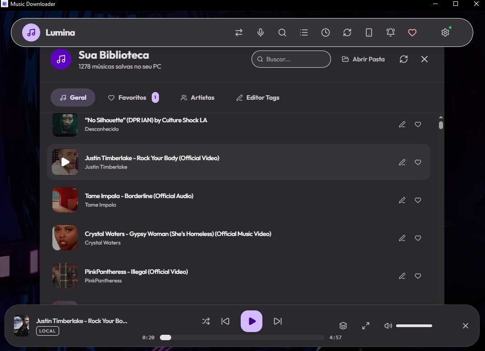
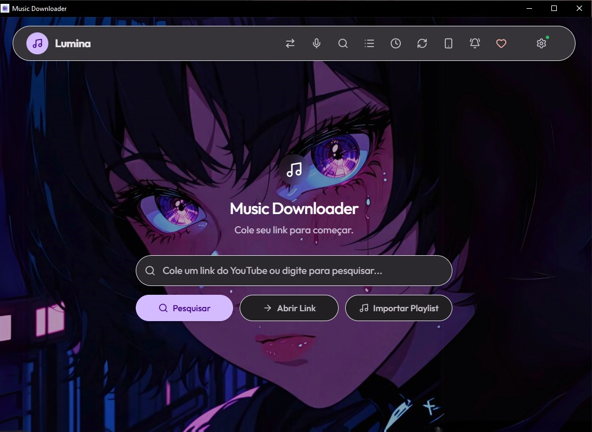
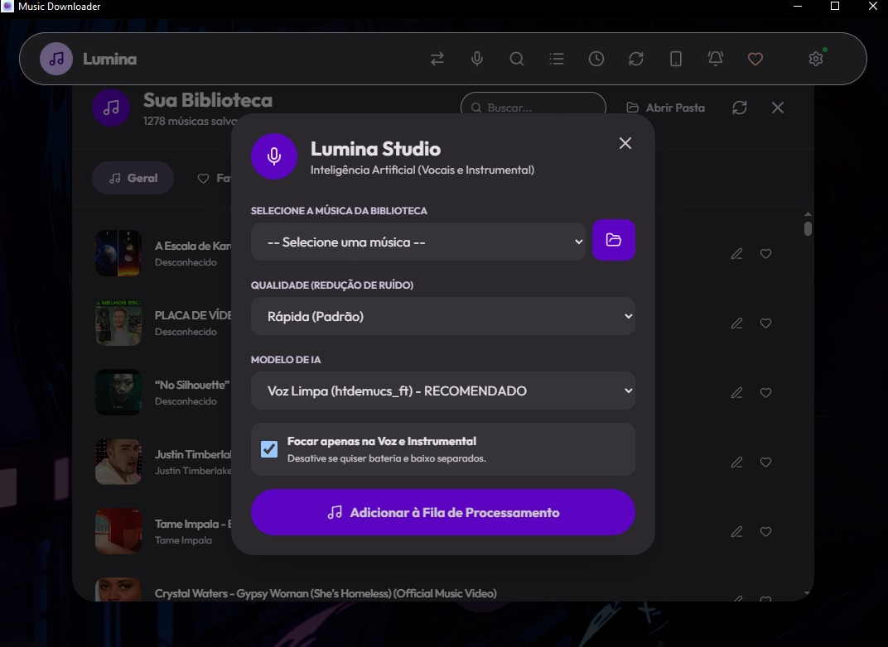
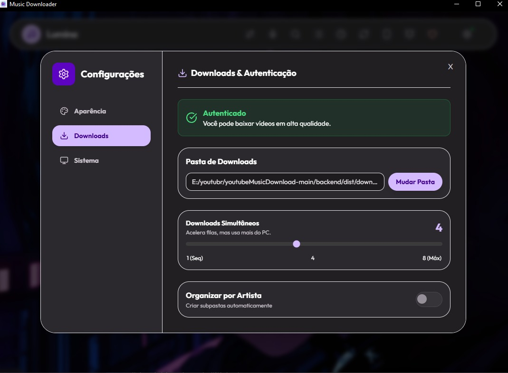

<div align="center">
  
  <h1>Lumina 3.8.0</h1>
  <p>A professional, lightweight, and incredibly fast solution for downloading high-fidelity music and videos from YouTube, Spotify, and Apple Music without ads, cookies, or limits.</p>

  [](https://Echiiiro453.github.io/youtubeMusicDownload/)
  [](LICENSE)
  [](#)
</div>

---

[English](#english) | [Português](#português)

---

## English

### Why Lumina?
Most open-source video downloaders use outdated UI frameworks, consume gigabytes of RAM (due to Electron), and break frequently because they rely on basic browser scraping. **Lumina is different.**
Built on an ultra-lightweight **React + PyWebView** architecture, Lumina consumes a fraction of the RAM of standard desktop apps while providing a dynamic *Material You* UI. Under the hood, it uses advanced **Client Impersonation** (Android VR, iOS, Web Creator) combined with an embedded Node.js engine to bypass JavaScript challenges, ensuring you get **True 4K HDR** downloads. It also securely supports your browser cookies for downloading age-restricted or premium content!

<div align="center">
  
</div>

### Quick Start (No Installation Required)
Lumina requires absolutely no installation or registry changes. It is a 100% portable executable.
1. Download the latest `Lumina.exe` from the Releases page.
2. Double click the file.
3. Paste a YouTube, Spotify, or Apple Music URL and watch the magic happen!

> **Note on Windows Defender:** Because Lumina is an indie open-source project and isn't signed with a $400/year corporate certificate, Windows SmartScreen may show an "Unknown Publisher" warning on the first run. Click **More Info** -> **Run Anyway**.

### Features in Detail
- **True 4K & HDR Video**: Preserves high frame rates (60fps/120fps) and HDR metadata perfectly.
- **High Fidelity Audio**: Export as M4A or 320kbps MP3.
- **Lumina Studio AI**: Built-in Meta Demucs integration. Separate vocals, drums, and instruments from any downloaded track using local Neural Networks (100% private, no cloud uploads).
- **Voice Control**: Say "Lumina, pause!" or "Lumina, next!" to control your music hands-free via our embedded offline Vosk AI model.
- **Shazam Lab**: Automatically scans unknown audio files and injects ID3 tags, album art, and lyrics.
- **Lumina Sync**: Scan a QR code on your PC to instantly transfer your downloaded music to your smartphone via Local Wi-Fi.
- **Anti-Ban Architecture**: 16 layers of evasion including rotating proxies, fallback clients, and embedded JS deciphering.

<div align="center">
  
</div>

### 📦 Full Setup (For Developers)
If you want to build Lumina from source or contribute to the code:
```bash
# 1. Clone the repository
git clone https://github.com/Echiiiro453/youtubeMusicDownload.git
cd youtubeMusicDownload

# 2. Build the React Frontend
cd frontend
npm install
npm run build
cd ..

# 3. Setup Python Backend Environment (Python 3.10+ Required)
cd backend
python -m venv venv
venv\Scripts\activate
pip install -r requirements.txt

# 4. Compile the final portable .exe
python build_exe.py
```

### 🐧 Linux Usage
Since the official release is a Windows `.exe`, the easiest way to run Lumina on Linux is via **Wine** or **Proton** (Bottles/Steam).
```bash
wine Lumina.exe
```
Alternatively, follow the Developer instructions above to build natively on Linux. Make sure to install `webkit2gtk` and `python3-dev` dependencies for PyWebView!

---

## Português

### Por que o Lumina?
A maioria dos baixadores de vídeo open-source usa interfaces antigas, consome gigabytes de RAM (por usarem Electron) e falha constantemente ao baixar vídeos porque dependem de técnicas básicas. **O Lumina é diferente.**
Construído em uma arquitetura ultraleve de **React + PyWebView**, o Lumina consome uma fração da RAM de apps convencionais, mantendo um design dinâmico *Material You*. Por trás dos panos, ele usa **Personificação de Cliente** (Android VR, iOS, Web Creator) combinado com um motor Node.js embutido para burlar desafios de JavaScript. Isso garante downloads em **4K HDR Real**, além de contar com suporte nativo e seguro para os cookies do seu navegador, permitindo baixar conteúdos restritos de forma nativa!

<div align="center">
  
</div>

### Começo Rápido (Sem Instalação)
O Lumina não requer instalação e não suja o registro do seu sistema. Ele é 100% portátil.
1. Baixe o último `Lumina.exe` na aba de Releases.
2. Dê dois cliques no arquivo.
3. Cole o link de um vídeo do YouTube, Spotify ou Apple Music e veja a mágica acontecer!

> **Aviso do Windows Defender:** Como o Lumina é um projeto indie de código aberto e não possui um certificado corporativo pago de 400 dólares por ano, o SmartScreen do Windows pode mostrar um aviso de "Fornecedor Desconhecido" na primeira vez. Clique em **Mais Informações** -> **Executar Assim Mesmo**.

### Funcionalidades em Detalhes
- **Vídeos 4K e HDR**: Preserva altas taxas de quadros (60fps/120fps) e cores HDR perfeitamente.
- **Áudio de Alta Fidelidade**: Exporte como M4A ou MP3 em 320kbps.
- **Lumina Studio AI**: Integração nativa com o Meta Demucs. Separe vocais, baterias e instrumentos de qualquer música usando Redes Neurais locais (100% privado, sem envios para nuvem).
- **Controle por Voz**: Diga "Lumina, pausar!" ou "Lumina, próxima!" para controlar suas músicas usando nosso modelo de IA Vosk embutido e offline.
- **Laboratório Shazam**: Escaneia automaticamente arquivos desconhecidos e injeta capas de álbum, artistas e letras (ID3 tags).
- **Lumina Sync**: Escaneie o QR Code na tela do PC e transfira suas músicas recém-baixadas instantaneamente para o seu celular via Wi-Fi Local.
- **Arquitetura Anti-Ban**: 16 camadas de evasão incluindo proxies rotativos, clientes de fallback e quebra nativa de criptografia JS.

<div align="center">
  
</div>

### 📦 Setup Completo (Para Desenvolvedores)
Se você quiser compilar o Lumina do zero ou contribuir com o código:
```bash
# 1. Clonar o repositório
git clone https://github.com/Echiiiro453/youtubeMusicDownload.git
cd youtubeMusicDownload

# 2. Compilar a Interface React
cd frontend
npm install
npm run build
cd ..

# 3. Configurar Ambiente Python (Requer Python 3.10+)
cd backend
python -m venv venv
venv\Scripts\activate
pip install -r requirements.txt

# 4. Compilar o .exe final
python build_exe.py
```

### 🐧 Uso no Linux
Como a versão oficial é um executável Windows (`.exe`), a maneira mais fácil de usar o Lumina no Linux é via **Wine** ou **Proton** (Bottles/Steam).
```bash
wine Lumina.exe
```
Alternativamente, siga as instruções de Desenvolvedor acima para compilar nativamente. Certifique-se de instalar as dependências `webkit2gtk` e `python3-dev` para o PyWebView!

---
*Developed by [Echiiiro453](https://github.com/Echiiiro453)*
