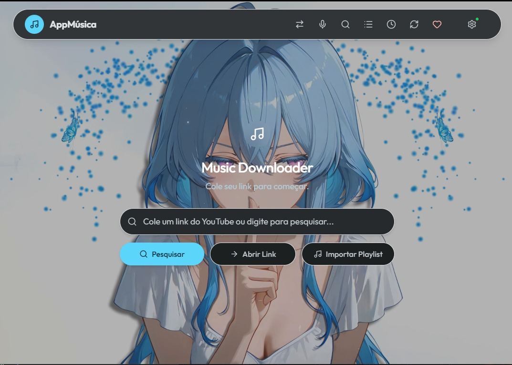
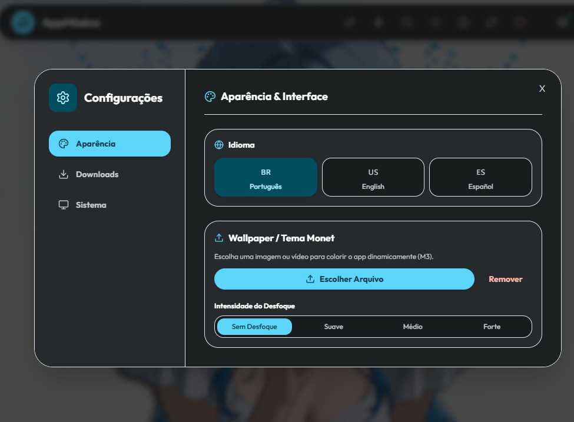

<div align="center">
  <h1>AppMusica</h1>
  <p>A professional, lightweight solution for downloading high-fidelity music and videos from YouTube, Spotify, and Apple Music.</p>

  [](https://Echiiiro453.github.io/youtubeMusicDownload/)
  [](LICENSE)
  [](#)
</div>

---

[English](#english) | [Português](#português)

---

## English

### Overview
AppMusica is an advanced media downloader built for performance and reliability. It features a modern desktop interface and powerful backend capable of handling massive playlists, bypassing anti-bot protections, and separating audio tracks using artificial intelligence.

<div align="center">
  
</div>

### Key Features
- **High Fidelity Audio**: Support for MP3 (320kbps), M4A, and FLAC (Lossless) formats.
- **4K Video**: Download high-resolution videos up to 60fps.
- **Smart Metadata**: Automatic embedding of album covers, artists, titles, and lyrics directly into your audio files.
- **Multi-Platform**: Native desktop experience built with PyWebView and FastAPI.
- **Magic Search**: Search and download songs by directly pasting Spotify, Deezer, SoundCloud, or Apple Music links.
- **Smart Retry & Proxy Survival**: Intelligent system utilizing fallback clients and rotating proxies to bypass IP blocks and download thousands of songs seamlessly.
- **Queue Memory**: Automatically saves pending downloads allowing you to resume interrupted sessions anytime.
- **AppMusica Studio AI**: Built-in vocal and instrumental separator powered by Demucs (State-of-the-art music source separation by Meta Research).
- **Shazam Lab**: Native metadata fixer powered by Shazamio to recognize unknown MP3 files and automatically inject ID3 tags and album covers.
- **Global Localization**: Dynamic UI translation supporting English (US), Spanish (ES), and Portuguese (BR).

<div align="center">
  
</div>

**Note on Video Playback**: The default Windows Media Player or "Movies & TV" app may struggle to play certain downloaded `.mp4` videos due to missing modern codecs. We highly recommend using [VLC Media Player](https://www.videolan.org/vlc/).

**Note on AI Processing**: The AppMusica Studio AI feature utilizes up to 100% of your CPU cores during audio separation. This is because it performs heavy local Neural Network inference via PyTorch. This consumption is completely safe, expected, and ensures maximum privacy as no audio is uploaded to the cloud.

### Project Structure
```text
youtubeMusicDownload/
├── backend/           # Core Python Logic (FastAPI + yt-dlp + PyInstaller)
├── frontend/          # Web/Desktop Interface (React)
├── README.md          # Documentation
├── TERMS.md           # Terms of Use
└── PRIVACY.md         # Privacy Policy
```

### Legal Disclaimer & Privacy
Please read the [Terms of Use](TERMS.md) and [Privacy Policy](PRIVACY.md) before using this software. AppMusica is intended for personal and educational use only. The developer does not promote or endorse copyright infringement.

### Desktop Setup (Development)
1. Install [Node.js](https://nodejs.org/) and [Python 3.10+](https://www.python.org/).
2. Setup Frontend: `cd frontend && npm install && npm run build`
3. Setup Backend: `cd backend && pip install -r requirements.txt`
4. Build Portable `.exe`: `python build_exe.py`

### Linux Usage

**Option 1: Wine/Proton (Recommended)**
Since the compiled release is a Windows executable (`.exe`), the easiest way to run it on Linux is via [Wine](https://www.winehq.org/) or [Proton](https://github.com/ValveSoftware/Proton) (via Steam or [Bottles](https://usebottles.com/)).
```bash
wine AppMusica.exe
```

**Option 2: Native Execution (Source Code)**
To run natively from the source code, you must install the `pywebview` dependencies for Linux (GTK and WebKit2) based on your distribution:

**Ubuntu/Debian:**
```bash
sudo apt install python3-dev build-essential libgirepository1.0-dev libcairo2-dev gir1.2-gtk-3.0 gir1.2-webkit2-4.1
```

**Arch Linux / Manjaro:**
```bash
sudo pacman -S python base-devel gobject-introspection cairo gtk3 webkit2gtk
```

**Fedora:**
```bash
sudo dnf install python3-devel gcc cairo-devel gobject-introspection-devel gtk3-devel webkit2gtk4.1-devel
```

Then follow the Desktop Setup instructions using a virtual environment:
```bash
# 1. Setup Frontend
cd frontend && npm install && npm run build && cd ..

# 2. Setup Backend inside a Virtual Environment
cd backend
python3 -m venv venv
source venv/bin/activate
pip install -r requirements.txt

# 3. Build Portable Linux Executable
python build_exe.py
```

---

## Português

### Visão Geral
O AppMusica é uma solução avançada para download de mídias, construída para entregar performance e estabilidade. O software conta com uma interface moderna para desktop e um backend robusto capaz de lidar com playlists gigantes, desviar de proteções antibot e separar faixas de áudio usando inteligência artificial.

<div align="center">
  
</div>

### Funcionalidades Principais
- **Áudio de Alta Fidelidade**: Suporte para os formatos MP3 (320kbps), M4A e FLAC (Lossless).
- **Vídeo em 4K**: Download de vídeos em alta resolução de até 60fps.
- **Metadados Inteligentes**: Inserção automática de capas de álbum, artistas, títulos e letras diretamente nos seus arquivos de áudio.
- **Multi-Plataforma**: Experiência desktop nativa construída com PyWebView e FastAPI.
- **Magic Search**: Busque e baixe músicas simplesmente colando links do Spotify, Deezer, SoundCloud ou Apple Music.
- **Smart Retry & Proxy Survival**: Sistema inteligente que utiliza clientes de fallback e proxies rotativos para ignorar bloqueios de IP e baixar milhares de músicas sem interrupções.
- **Memória de Fila**: Salva automaticamente seus downloads pendentes, permitindo que você retome sessões interrompidas a qualquer momento.
- **AppMusica Studio AI**: Separador de vocais e instrumentais integrado, alimentado pelo Demucs (Inteligência Artificial de ponta desenvolvida pela Meta Research).
- **Laboratório Shazam**: Corretor de metadados nativo alimentado pelo Shazamio para reconhecer arquivos MP3 desconhecidos e injetar tags ID3 e capas de álbuns automaticamente.
- **Localização Global**: Interface com tradução dinâmica e suporte nativo a Inglês (US), Espanhol (ES) e Português (BR).

<div align="center">
  
</div>

**Aviso sobre Reprodução de Vídeo**: O Windows Media Player ou o aplicativo "Filmes e TV" padrão do Windows podem apresentar falhas ao reproduzir alguns vídeos `.mp4` baixados devido à falta de codecs modernos. Recomendamos fortemente o uso do [VLC Media Player](https://www.videolan.org/vlc/).

**Aviso sobre Processamento de IA**: O recurso AppMusica Studio AI utiliza até 100% dos núcleos do seu processador durante a separação de áudio. Isso ocorre porque o sistema realiza cálculos matemáticos pesados de Rede Neural localmente via PyTorch. Esse consumo é totalmente seguro, esperado e garante máxima privacidade, pois nenhum áudio é enviado para a nuvem.

### Estrutura do Projeto
```text
youtubeMusicDownload/
├── backend/           # Lógica central em Python (FastAPI + yt-dlp + PyInstaller)
├── frontend/          # Interface Web/Desktop (React)
├── README.md          # Documentação
├── TERMS.md           # Termos de Uso
└── PRIVACY.md         # Política de Privacidade
```

### Termos de Uso e Privacidade (Aviso Legal)
Por favor, leia os [Termos de Uso](TERMS.md) e a [Política de Privacidade](PRIVACY.md) antes de utilizar este software. O AppMusica é destinado exclusivamente para uso pessoal e educacional. O desenvolvedor não promove ou endossa a pirataria ou infração de direitos autorais.

### Configuração Desktop (Desenvolvimento)
1. Instale o [Node.js](https://nodejs.org/) e o [Python 3.10+](https://www.python.org/).
2. Frontend: `cd frontend && npm install && npm run build`
3. Backend: `cd backend && pip install -r requirements.txt`
4. Compilar `.exe` portátil: `python build_exe.py`

### Uso no Linux

**Opção 1: Wine/Proton (Recomendado)**
Como o aplicativo final é um executável Windows (`.exe`), a maneira mais fácil e rápida de rodar no Linux é usando o [Wine](https://www.winehq.org/) ou o [Proton](https://github.com/ValveSoftware/Proton) (através da Steam ou do [Bottles](https://usebottles.com/)).
```bash
wine AppMusica.exe
```

**Opção 2: Execução Nativa (Código Fonte)**
Para rodar nativamente pelo código fonte, você precisa instalar as dependências do `pywebview` para Linux (GTK e WebKit2) no seu terminal, dependendo da sua distribuição:

**Ubuntu/Debian:**
```bash
sudo apt install python3-dev build-essential libgirepository1.0-dev libcairo2-dev gir1.2-gtk-3.0 gir1.2-webkit2-4.1
```

**Arch Linux / Manjaro:**
```bash
sudo pacman -S python base-devel gobject-introspection cairo gtk3 webkit2gtk
```

**Fedora:**
```bash
sudo dnf install python3-devel gcc cairo-devel gobject-introspection-devel gtk3-devel webkit2gtk4.1-devel
```

Depois, siga os passos de Configuração Desktop utilizando um ambiente virtual (venv):
```bash
# 1. Compilar Frontend
cd frontend && npm install && npm run build && cd ..

# 2. Configurar Backend num Ambiente Virtual (venv)
cd backend
python3 -m venv venv
source venv/bin/activate
pip install -r requirements.txt

# 3. Compilar Executável Nativo para Linux
python build_exe.py
```

---
*Developed by [Echiiiro453](https://github.com/Echiiiro453)*
